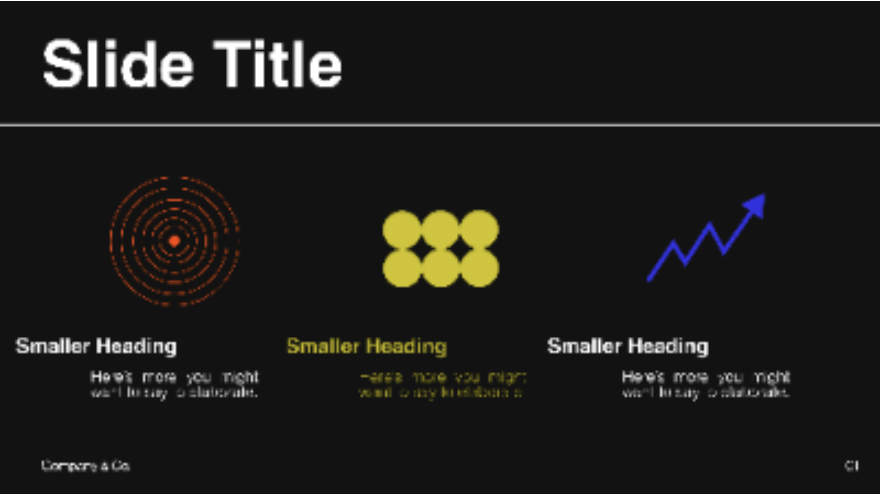
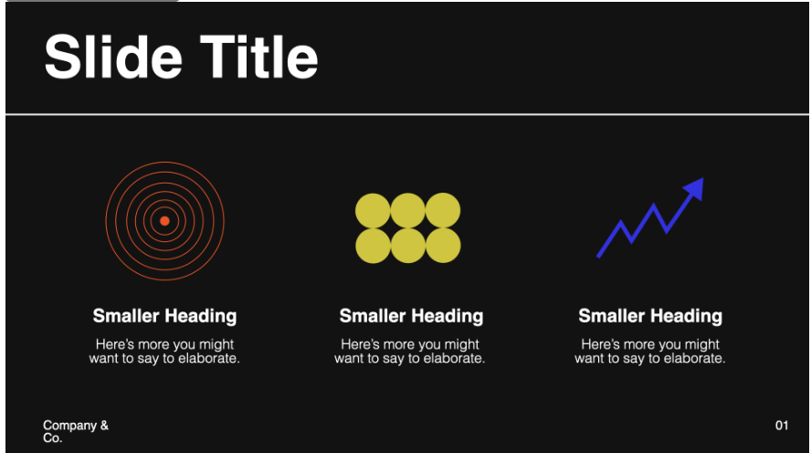
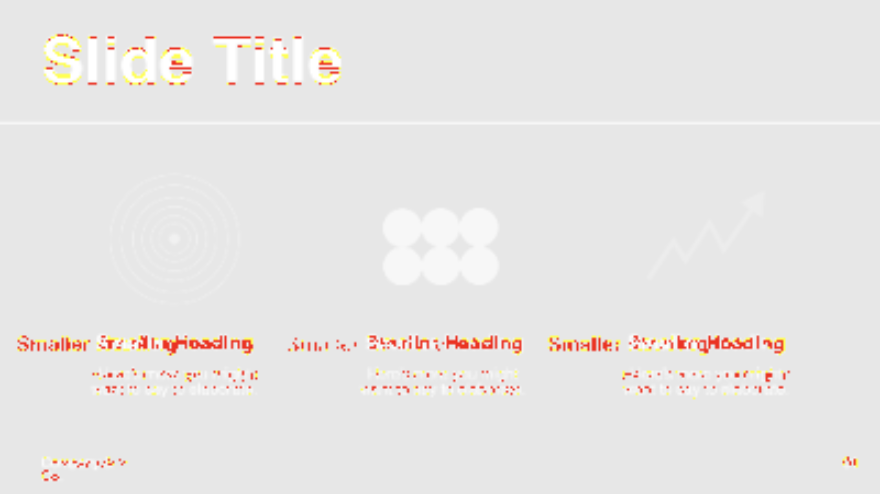

# Pixelmatch Figma Plugin

Exports from Figma frames are not always accurate, especially when the target format is in pptx. This plugin highlights the diffs by using `pixelmatch` offline.

## Reference

- https://github.com/mapbox/pixelmatch
